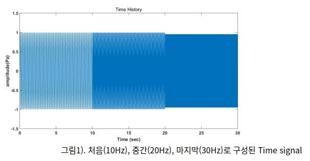

# KAMP AI 데이터를 STFT, CWT 변환을 활용해 데이터 성능 업그레이드

- 참고자료
    
    [[Open DMQA Seminar] Fourier Transform for Signal Data](https://youtu.be/Q5L_Ky6nKVo?si=flJneW1OsTf0z784)
    
    [XAI Review - 4. XAI in Computer Vision(Saliency map, TCAV, latest methodology)](https://youtu.be/ai-4wh7z5FY?si=GbCfPozaRW5qOFEv)
    
- STFT가 무엇인가?
    - Short Time Fourier Transform
    - 시간 구간을 짧게 나눠, 나눠진 여러 구간의 데이터를 각각 푸리에 변환하는 방법
    - 푸리에 변환이란,
        - 시간이나 공간에 대한 함수를 시간 또는 공간 주파수 성분으로 분해하는 변환
- 이건 어디에 쓰이는가?
    - 소음 진동 분석에 기본이자 필수인 신호처리 기법
- 왜 쓰는가?
    - 다음과 같이 시간에 따라 변하는 주파수로 구성된 Time Signal이 있다고 가정
        
        
        
    - 그냥 전체 구간에 대해서 푸리에 변환을 하면?
        
        
        
        - 언제, 어떤 주파수를 가졌는지 분석할 수 없다.
    - 그래서 Time 에 따라 어떤 주파수를 가졌는지 알 수 있는
        
        
        
- STFT에 대한 그래프를 그리는 파이썬 코드
    
    ```python
    from scipy.signal import stft
    
    input_folder = '인풋풀더명'
    output_folder = '출력폴더명'
    
    file_list = os.listdir(input_folder)
    
    for file_name in file_list:
        if file_name.endswith('.csv'):
            file_path = os.path.join(input_folder, file_name)
            data = pd.read_csv(file_path)
            fs = 5000
            nperseg = 64
            noverlap = nperseg//2
            nfft = nperseg
    
            signal = data['moter2_z']
            f, t, Zxx = stft(signal, fs=fs, nperseg=nperseg, noverlap=noverlap, nfft=nfft)
    
            plt.figure()
            plt.pcolormesh(t, f, np.abs(Zxx), vmin=0, vmax=np.abs(Zxx).max(), shading='auto', cmap='jet')
    
            output_file_name = os.path.splitext(file_name)[0] + '.png'
            output_file_path = os.path.join(output_folder, output_file_name)
            plt.savefig(output_file_path)
    
            plt.close()
    ```
    
- CWT 변환이란?
    
    [A Class of Algorithms for Continuous Wavelet Transform Based on the Circulant Matrix](https://www.mdpi.com/1999-4893/11/3/24)
    
    - Continuous Wavelet Transform
    - 시간에 따라 주파수 특성이 변하는데 이 변화를 포착하기 위해 CWT를 활용한 전처리 과정을 갖는다.
    - 고장 진단에 보통 일정한 주파수를 normal로 잡았음
    - 근데 순간 가속 되었다가 감속 되면서 제어되는 기계들이 있음
    - 즉, 언제 어떤 주파수를 가지는 지에 따라 이게 고장인지 아닌지 알아야함
        - 시간을 고려해야한다.
    - 주파수의 변화를 포착하기 위해 일반적인 주파수를 CWT을 사용해 전처리 과정을 갖는다.
    
    ---
    
    - 가장 먼저, WT, 즉 Wavelet Transform이 무엇인 지 알아야 한다.
        - 임의의 신호를 Wavelet으로 정의되는 함수들로 분해하는 방법이다.
        - cf) 푸리에 변환
            - 무한히 진동하는 여러 Sine, Cos함수를 기저함수로 여겨 신호를 분해함
        - WT는 진동하는 시간이 제한되는 함수!!를 기저함수로 사용함
    
    ---
    
    - 그러면, Wavelet이 무엇인가?
        - 정해진 시간 안에서 증가와 감소를 반복하며 진동하는, 평균이 0인 진동
        - 종류가 매우 많음
            
            
            
    - 위와 같은 웨이블릿은 파장을 조정할 수 있다.
        - 예를 들어, 시간축 방향을 늘이면 (Scale Factor) 파장이 긴 데이터를 만들어 낼 수 있다.
            
            
            
    - 이런 웨이블릿 변환은 다음과 같은 수식으로 나타낼 수 있음
        
        
        
    - 그 결과, 다음과 같은 시간에 따른 2D 이미지 형태로 결과를 나타낼 수 있다.
        - 이때, Scale을 중심 주파수로 설정하면, Y축은 주파수 값으로 나타낼 수 있다.
            
            
            
    
    ---
    
    - 그럼 이제 연속 웨이블릿 변환에 대해 예시 코드와 함께 살펴보자.
        - Morlet을 웨이블릿으로 사용하면 Morlet Wavelet 함수는 다음과 같다.
            
            
            
        - 위의 코드를 기반으로, 웨이블릿을 생성해보자.
            - 아래의 코드로 하여금, 주파수 T를 나타내는 웨이블릿 생성
            
            ```python
            import numpy as np
            def psi(T, f0=6):
                '''
            	  T : parameter for adjusting length of wavelet
            	  f0 : parameter for time-frequenct resolution trade off 
                '''
                x = np.linspace(-2 * np.pi, 2 * np.pi, T)
                return (np.pi ** -0.25) * np.exp(1j * f0 * x - x ** 2 / 2)
            ```
            
            - 웨이블릿의 길이가 길 수록, 더 많은 신호 부분을 포괄하게 되며, 파장이 긴 저주파수 성분들을 잡아내기 용이함.
        - 웨이블릿 변환은, 생성한 웨이블릿과 현재 신호 간의 상관계수를 뽑아내는 것이다.
            - 그렇기에 Convolution 연산을 활용해 상관계수를 구할 수 있다.
                
                
                
                
                
            - 변환 코드
                
                ```python
                from scipy.fft import fft, ifft
                
                def wavelet_convolution(f, T):
                    '''
                    f : input signal
                    T : length of wavelet
                    '''
                    f_len = np.shape(f)[0]
                    f_hat = np.append(f, np.zeros(T))
                    h = psi(T)
                    h_hat = np.append(h, np.zeros(f_len))
                    return ifft(fft(f_hat)*fft(h_hat))[round(T/2) : round(T/2) + f_len]
                ```
                
        - 결과를 보면
            
            
            
            - Input Signal을 웨이블릿 변환을 T=100과 T=400으로 한 값이다.
            - 길이가 100인 웨이블릿은 입력 신호와 유사도가 낮기에 Convolution값이 낮음
            - 근데 400인 웨이블릿은 입력 신호와 유사도가 높아, Convolution값이 높다.
                - 즉, 400인 웨이블릿의 주파수 성분은 입력신호에 많이 담고 있다고 해석할 수 있다.
            - 이를 활용해, 해당 신호에 어떤 주파수 성분이 얼마나 담겨있는지 알 수 있다.
    - 그 결과, Continuous Wavelet Transform은?
        
        
        
        - 설명
            1. f[n]은 시그널
                1. f[n]이 [1,-1,1,-1] 포인트
            2. 초기 웨이블릿 함수
            3. 스케일: 2라고 가정
            4. 지지구간, 즉 웨이블릿 함수가 0이 아닌 구간을 [-1,1]로 가정
            5. 알고리즘
                1. aT: 2*1 = 2이므로, 패딩을 0으로 총 2*aT = 2*2 = 4개 준다.
                    1. f = [1,-1,1,-1,0,0,0,0]
                2. 모웨이블링 스케일링
                    1. 스케일 a = 2에 맞게 모웨이블릿의 파장 조절
                3. 이제 각 정수지점마다 모웨이블릿의 봉우리 결과 생성 및 패딩 길이 확장 → 웨이블릿 컨볼루션 필터용, 즉 웨이블릿 함수를 시간 영역에서 이산화한 값
                    1. h = [0.5,0,-0.5,0,0.5,0,0,0,0]라고 가정하자
                4. 고속 푸리에 연산을 활용해 컨볼루션연산 시작
                5. 결과, 각 시간에 따른 웨이블릿 함수와의 상관계수를 뽑을 수 있다.
        - 구현 코드
            
            ```python
            def wavelet_convolution(tup):
                f = tup[0]
                T = tup[1]
                f_len = np.shape(f)[0]
                f_hat = np.append(f, np.zeros(T))
                h = psi(T)
                h_hat = np.append(h, np.zeros(f_len))
                return ifft(fft(f_hat)*fft(h_hat))[round(T/2) : round(T/2) + f_len]
            
            def cwt(f, t0 = 20):
                '''
                f : input signal
                t0 : minimum length of wavelet
                '''
                f_len = np.shape(f)[0]
                result = np.array(list(map(wavelet_convolution, [(f, x) for x in range(t0, f_len, 10)])))
                return result
            ```
            
        - 구현 방식
            - cwt에 input signal을 넣고 그에 따른 wavelet convolution 결과를 넣어준다.
- Signal
    - 신호는 기본적으로 정현파
        - 이러한 정현파는 복소지수함수로 표현 가능하다.
- 학습
    - 결국 다차원의 데이터를 학습 시키는 거라면
    - Multimodal-Large-Language-Models을 활용할 수 있지 않을까?
        
        [https://github.com/BradyFU/Awesome-Multimodal-Large-Language-Models](https://github.com/BradyFU/Awesome-Multimodal-Large-Language-Models)